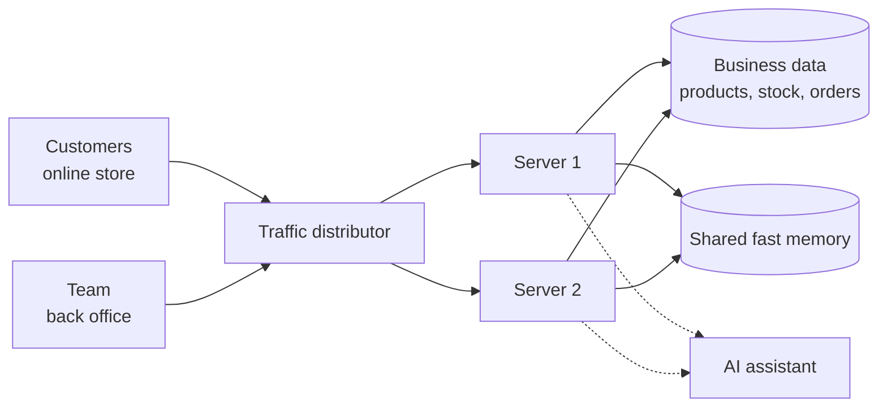

# Game Store

> Working name, subject to change. The roadmap from this demo to the real store is in
> [docs/master-plan.md](docs/master-plan.md).

**An online store that keeps working when sales grow, never sells what it does not have, and tells
management what to do next.**

Game Store is a working demo of the systems behind an e-commerce business: the storefront customers
see, the back office the team uses every day, and the engine that keeps both reliable under
pressure. It was built to show how technology can protect revenue, reduce manual work and turn
sales data into decisions.

---

## The problems it solves

| When an online store grows... | What Game Store does |
|---|---|
| Two customers buy the last unit at the same time and one order cannot be delivered | Stock is reserved at checkout in a way that makes overselling impossible. Tested with 200 simultaneous buyers for 8 units: exactly 8 orders, zero oversold. |
| Nobody can explain why the system says 12 units and the warehouse counts 9 | Every unit that enters, is reserved or leaves is recorded with who did it and when. Stock can always be traced. |
| Customers abandon carts and the products stay blocked | Unpaid orders release their stock automatically after 15 minutes, so it goes back on sale. |
| A campaign brings a traffic spike and the site slows down or goes offline | The system runs on several servers at once and can add more in minutes, with no code changes. |
| Someone changes a price by mistake, or tries to break into an account | Every sensitive change is logged, access depends on the person's role, and repeated login attempts are blocked. |
| Reports take hours in spreadsheets and arrive too late | An AI assistant writes an inventory and sales report in seconds, in English or Spanish, based on the store's real numbers. |
| Uploading a supplier catalog of thousands of products freezes the system | Large product files are processed in the background while the store keeps selling. |

---

## What the business gets

**Protected revenue.** No cancelled orders for stock that was never there, and no products stuck in
abandoned carts.

**Decisions backed by data.** The dashboard shows revenue, orders, average ticket and stock alerts.
It also computes which products will run out soon and how many units to reorder, based on how fast
each one sells and how long suppliers take to deliver.

**AI you can trust.** The AI never makes up figures. The system calculates the numbers first and
the AI only explains them in plain language: what to restock, what is not selling, which risks to
watch and a 7-day action plan. If the AI service is unavailable, the report is still produced.

**Ready to grow.** Capacity increases by adding servers, not by rewriting the system. In a load test
the store handled more than 9,000 requests in about a minute with zero errors, and product pages
loaded in under 20 milliseconds.

**Control and accountability.** Three roles with different permissions: administrators, warehouse
operators and customers. Price changes, stock corrections and login attempts are all recorded.

---

## How it is organized

The project is built in independent modules, each responsible for one area of the business. A
change in one does not break the others, and each can grow on its own.

| Module | Business area |
|---|---|
| **Catalog** | Products, categories, prices and promotions, search and filters |
| **Inventory** | Available, reserved and physical stock, full movement history, reorder alerts |
| **Orders** | Cart, checkout, payment, cancellation and automatic release of unpaid orders |
| **Security** | Accounts, roles and permissions, protection against abuse |
| **Audit** | A permanent record of who changed what and when |
| **Analytics** | Sales indicators, stock health and restock suggestions |
| **AI assistant** | Executive reports and product description suggestions |
| **Storefront** | The shopping experience for customers |
| **Back office** | Dashboard, inventory, products, bulk import, AI reports and audit log |

---

## A quick tour

1. **Storefront:** a customer searches, adds products to the cart and pays. The stock is reserved the
   moment the order is created.
2. **Flash sale simulation:** from the back office, 200 buyers try to buy the same product at the same
   instant. The system serves exactly as many as there are units and politely rejects the rest.
3. **Dashboard:** revenue, trends, best sellers, products about to run out and stock that is not
   moving.
4. **AI report:** one click produces a management report with concrete actions and quantities.
5. **Growth:** the footer shows which server answered each request, so you can see the load being
   shared.

Demo accounts, one per role, are available with one click on the login page.

---

## What this means for your company

The same building blocks apply to a real store:

- Connect the inventory to warehouses and marketplaces so stock is always the same everywhere.
- Automate purchase orders when the system detects a product will run out.
- Generate product descriptions and weekly reports with AI, reviewed by a person before publishing.
- Prepare the platform for high-traffic dates such as Black Friday or Cyber Monday.
- Keep a full audit trail for finance and compliance.

---

## For technical reviewers

The full technical documentation is in the [`docs`](docs) folder:

- [Technical guide](docs/technical-guide.md): stack, how to run it, tests and load test results
- [Architecture and design decisions](docs/architecture.md)
- [Demo guide](docs/demo-guide.md)
- [Legal texts and data rights](docs/legal/): the privacy policy and what the code already enforces
- [Master plan](docs/master-plan.md): the roadmap from this demo to a real console store with a repair workshop, backed by the [research reports](docs/research/)

Built with Java and Spring Boot, Angular, PostgreSQL, Redis, Nginx and Docker, with AI reports
powered by Google Gemini or OpenAI.

To run it with Docker: `docker compose up --build`, then open http://localhost:8088.

---

Built by **Andres Contreras** · Systems Engineering · [GitHub](https://github.com/AndresContreras1)
