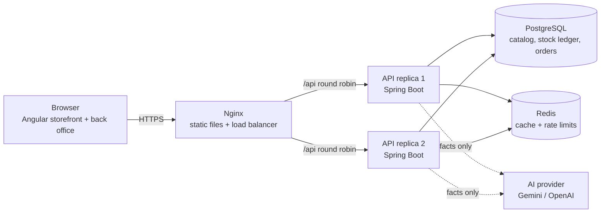

# Architecture

## Overview



The API is **stateless**: authentication travels in a signed JWT and all shared state lives in
PostgreSQL or Redis. Any replica can answer any request, so capacity grows by adding replicas
(`docker compose up -d --scale api=4`).

## Modules (backend)

| Package | Responsibility |
|---|---|
| `catalog` | Products, categories, search with composable filters, soft delete, bulk CSV import |
| `inventory` | Stock per product (on hand, reserved, available), append-only movement ledger, flash sale simulator |
| `orders` | Checkout, simulated payment, cancellation, automatic expiry of unpaid reservations |
| `security` | JWT authentication, roles, rate limiting, security headers |
| `audit` | Who changed what and when (prices, stock, logins, AI usage) |
| `analytics` | KPIs, sales velocity, days of cover, restock suggestions |
| `ai` | Provider-agnostic AI client, report generation, fallback writer |

## Key decisions

### 1. Overselling is prevented by the database
Checkout reserves stock with a single conditional statement:

```sql
UPDATE inventory_items
   SET reserved = reserved + :qty, version = version + 1
 WHERE product_id = :id AND (on_hand - reserved) >= :qty
```

The check and the write are atomic, so two buyers can never take the last unit, even on different
replicas. Less contended writes (receipts, adjustments, payment) use **optimistic locking**
(`@Version`) with an automatic retry. Multi-product checkouts lock rows in product-id order to avoid
deadlocks. Proven by `InventoryConcurrencyTest` and the flash sale simulator (200 concurrent buyers).

### 2. Reservations expire
Unpaid orders hold stock for 15 minutes. A scheduled job releases expired reservations; the order
row version guarantees that only one replica expires each order.

### 3. Stock is a ledger, not a number
Every change writes a `stock_movements` row (receipt, adjustment, reservation, release, sale) with
the resulting quantities. Current stock can always be explained and audited.

### 4. Catalog and inventory are separate tables
Stock changes on every sale while product data rarely changes. Keeping them apart means a price edit
never conflicts with a checkout.

### 5. Caching only where it is safe
| Cache | TTL | Why |
|---|---|---|
| Categories | 1 h | Almost never change |
| Dashboard | 60 s | Expensive aggregations, a minute of staleness is fine |
| AI reports | 10 min | Each call costs money and seconds |

Stock is never cached. In Docker the cache is Redis, shared by every replica.

### 6. Security
- Stateless JWT (2 h), BCrypt passwords, role-based access (`ADMIN`, `OPERATOR`, `CUSTOMER`).
- Rate limiting per IP: 10 login attempts/min (brute force), 300 API calls/min. Stored in Redis so the
  limit holds across replicas.
- Constant-time login (no user enumeration), 404 instead of 403 for other customers' orders.
- Audit log for sensitive actions; failed logins are recorded even though the request fails.
- Validation on every input, uniform error body, no stack traces in responses.

### 7. AI never invents numbers
The backend computes the facts (KPIs, velocity, days of cover, suggested order quantities) and sends
only those facts to the model, with instructions to use no other figures. The model never touches
the database. If the provider is slow, down or out of quota, a rule-based writer answers instead.
AI calls run outside database transactions so they never hold a pooled connection.

### 8. Bulk operations run in the background
CSV imports return `202 Accepted` with a job id and are processed in batches of 200, each in its own
transaction, on a bounded thread pool. Job progress is stored in the database because the status
request may reach a different replica.

## Scaling further (next steps)
- Read replicas for catalog and analytics queries.
- Message broker (Kafka / RabbitMQ) for order events: emails, invoicing and analytics consume them
  asynchronously.
- Materialized views or a data warehouse for analytics at millions of orders.
- Database migrations with Flyway instead of `ddl-auto`.
- CDN for static assets and product images.
- Distributed lock (ShedLock) for scheduled jobs, observability with Prometheus + Grafana.
