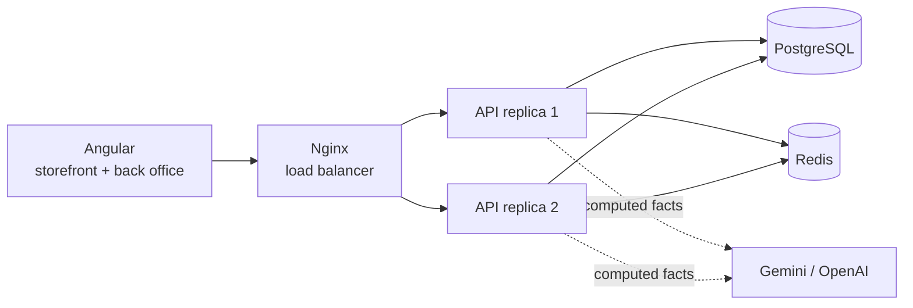

# Game Store: technical guide

Demo e-commerce platform focused on the problems that appear when an online store grows:
**product and inventory management, security, horizontal scalability and AI-assisted reporting.**

A Spring Boot API runs as several replicas behind Nginx, never oversells stock under concurrent
checkouts, keeps an auditable stock ledger and turns sales and inventory data into executive reports
with an LLM (Gemini or OpenAI), without letting the model invent numbers.



## Highlights

| Area | What it does | Where |
|---|---|---|
| **Catalog** | Products and categories, composable search filters, capped pagination, soft delete, N+1-free listings | `catalog` |
| **Inventory** | On hand / reserved / available, append-only stock ledger, reorder points, low-stock alerts | `inventory` |
| **No overselling** | Atomic conditional `UPDATE` for reservations, optimistic locking with retry elsewhere, deadlock-free multi-item checkout. Flash sale simulator: 200 concurrent buyers, never below zero | `InventoryRepository`, `FlashSaleSimulator` |
| **Orders** | Checkout reserves, payment commits, cancel/expiry releases; unpaid reservations expire after 15 min | `orders` |
| **Security** | JWT + roles (admin, operator, customer), BCrypt, per-IP rate limiting (strict on login), audit log, constant-time login, validated inputs | `security`, `audit` |
| **Scalability** | Stateless API, 2+ replicas behind Nginx, Redis cache and distributed rate limits, bounded connection pools, async CSV import in batches | `docker-compose.yml`, `common` |
| **AI reports** | Inventory health and sales reports (English/Spanish), product description suggestions; facts computed by code, provider fallback, cached for 10 min | `analytics`, `ai` |
| **Back office** | KPI dashboard, restock suggestions, inventory with ledger, product editor, CSV import, AI reports, audit log | `frontend/src/app/admin` |

Design decisions are explained in [architecture.md](architecture.md). A 5-minute walkthrough
is in [demo-guide.md](demo-guide.md).

## Stack

| Layer | Technology |
|---|---|
| API | Java 25 LTS (virtual threads on), Spring Boot 4.1, Spring Data JPA, Spring Security 7, Bean Validation |
| Database | PostgreSQL 16, schema owned by Flyway migrations, also in tests through Testcontainers |
| Cache / shared state | Redis (Caffeine in memory for local runs) |
| Frontend | Angular 20 (standalone components, signals, lazy routes) |
| AI | Google Gemini or OpenAI over REST, rule-based fallback |
| Infra | Docker Compose, Nginx, GitHub Actions, k6 |
| Docs | OpenAPI / Swagger UI |

## Run it

**Option A: full stack with Docker** (recommended)

```bash
docker compose up --build
```

- App: http://localhost:8088
- Swagger UI: http://localhost:8088/swagger-ui/index.html
- Scale out: `docker compose up -d --scale api=4`

**Option B: local API against a PostgreSQL container.** The schema comes from the Flyway migrations
(see [migrations](migrations.md)), so a database is required. Needs a JDK 25; with an older JDK
installed, build inside a container instead:
`docker run --rm -v "$PWD/backend":/app -w /app maven:3.9-eclipse-temurin-25 mvn test`

```bash
docker compose up -d postgres
```

```bash
cd backend
./mvnw spring-boot:run
```

```bash
cd frontend
npm install
npm start
```

Open http://localhost:4200 (the dev server proxies `/api` to `localhost:8080`).

Demo data (40 products, 60 days of sales history, three users) is created automatically on an empty
database.

## Demo accounts

**Demo only.** The login page has one-click buttons for each role.

| Role | Email | Password | Can do |
|---|---|---|---|
| ADMIN | admin@gamestore.co | Admin123! | Everything: catalog, prices, inventory, reports, audit |
| OPERATOR | operator@gamestore.co | Operator123! | Inventory only |
| CUSTOMER | customer@gamestore.co | Customer123! | Storefront and own orders |

## AI reports

The backend computes the numbers (KPIs, sales velocity, days of stock cover, suggested restock
quantities) and the AI only turns them into an executive report. Every report shows the facts it was
given.

| Variable | Default | Purpose |
|---|---|---|
| `AI_PROVIDER` | `mock` | `mock`, `gemini` or `openai` |
| `GEMINI_API_KEY` / `GEMINI_MODEL` | - / `gemini-3.8-flash` | Google Gemini |
| `OPENAI_API_KEY` / `OPENAI_MODEL` | - / `gpt-4o-mini` | OpenAI |

Copy `.env.example` to `.env` to set them for Docker Compose. Without an API key, or if the provider
fails (timeout, quota), a rule-based writer answers instead.

## Tests

```bash
cd backend
./mvnw test
```

27 integration tests cover the catalog API, concurrent reservations (flash sale), the order
lifecycle, authentication and authorization, rate limiting, AI fallback and the background import.

## Load test

[k6](https://k6.io) script in `loadtest/`: 50 users browsing plus 10 buyers competing for the same
products, against the Docker stack (2 replicas).

```bash
RATE_LIMIT_API_PER_MINUTE=1000000 docker compose up -d api   # one IP generates all the traffic
docker run --rm -i -e BASE_URL=http://host.docker.internal:8088 grafana/k6 run - < loadtest/catalog-and-checkout.js
```

Measured on a laptop (70 s, 60 virtual users):

| Metric | Result |
|---|---|
| Requests | 9,417 (132 req/s) |
| Failed requests | 0 % |
| Catalog latency p95 | 16 ms |
| All requests p95 | 23 ms |
| Checkouts | only `201` or `409 not enough stock`, never `500` |

With the default limit (300 req/min per IP) the same test is mostly answered with `429`: the rate
limiter doing its job.

## Bulk import

```bash
python tools/generate_products_csv.py 5000 > products.csv
```

Upload it from *Back office > Products > Import CSV*. The API answers `202 Accepted` at once and
processes the file in the background; progress is shown live.

## Project structure

```
backend/     Spring Boot API (catalog, inventory, orders, security, audit, analytics, ai)
frontend/    Angular storefront and back office
infra/       Nginx configuration (static files + load balancer)
loadtest/    k6 scenarios
tools/       Helper scripts (CSV feed generator)
docs/        Architecture and demo guide
```
